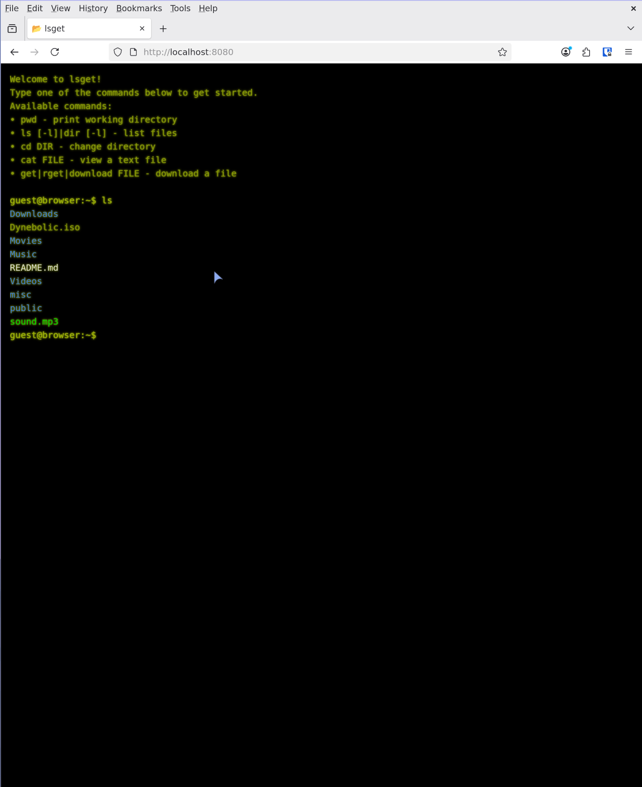

<div align="center">

# lsget

### Tiny Go-powered web server with a full‑screen, neon‑themed browser terminal.

</div>

<p align="center">
  <a href="https://dyne.org">
    
  </a>
</p>


---
<br><br>

Serve securely any local directory as a mini *cloud* and poke around with familiar `pwd`, `ls`, `cd`, `cat`, and `get|download` commands — right from your browser. 
For hackers: hot‑reload your server with [Air](https://github.com/cosmtrek/air) via `task dev` for an instant Go hacking loop.


## lsget features

| Capability           | Details |
|----------------------|---------|
| Web‑based terminal   | Reactive UI powered by **[DataStar](https://github.com/starfederation/datastar)**; smooth key handling & history. |
| File ops             | `pwd`, `ls [-l]`, `cd DIR`, `cat FILE`, `download FILE`. |
| Smart autocompletion | Tab‑completes dirs/files (text‑only, size‑limited for `cat`). |
| Colourised `ls`      | Directories in bright blue (Ubuntu style) with trailing `/`. |
| Session isolation    | Per‑browser *in‑memory* CWD tracked via cookie. |
| Live reload          | `task dev` ⇒ [Air](https://github.com/cosmtrek/air) rebuilds `main.go` on save. |
| Zero‑config binary   | `go run .` or `go build` produces a single executable. |



# [LIVE DEMO](https://files.dyne.org:31337)

<br>

<div id="toc">

### 🚩 Table of Contents

- [💾 Install](#-install)
- [🎮 Quick start](#-quick-start)
- [🚑 Community & support](#-community--support)
- [😍 Acknowledgements](#-acknowledgements)
- [👤 Contributing](#-contributing)
- [💼 License](#-license)

</div>

***
## 💾 Install
Single binary, no need to install anything!

```bash
# Download
curl -fsSL  "https://github.com/dyne/lsget/releases/latest/download/lsget-$(uname -s)-$(uname -m)" -o lsget && chmod +x lsget
```


**[🔝 back to top](#toc)**

***
## 🎮 Quick start

To start using lsget run the following commands

```bash
# Download and run
curl -fsSL  "https://github.com/dyne/lsget/releases/latest/download/lsget-$(uname -s)-$(uname -m)" -o lsget && chmod +x lsget
./lsget
```
Open your browser at `http://localhost:8080` and enjoy the neon green shell.

### Configuration flags

| Flag        | Default            | Description |
|-------------|--------------------|-------------|
| `-addr`     | `localhost:8080`   | HTTP listen address. |
| `-dir`      | `.` (cwd)          | Directory to expose as `/`. |
| `-catmax`   | `262144` (256 KiB) | Max bytes printable via `cat` & completion filter. |


**[🔝 back to top](#toc)**

***
## 🚑 Community & support

**[📝 Documentation](#toc)** - Getting started and more.

**[🚩 Issues](../../issues)** - Bugs end errors you encounter using lsget.

**[[] Matrix](https://socials.dyne.org/matrix)** - Hanging out with the community.

**[🗣️ Discord](https://socials.dyne.org/discord)** - Hanging out with the community.

**[🪁 Telegram](https://socials.dyne.org/telegram)** - Hanging out with the community.


**[🔝 back to top](#toc)**

***
## 😍 Acknowledgements

<a href="https://dyne.org">
  
</a>


Copyleft 🄯 2025 by [Dyne.org](https://www.dyne.org) foundation, Amsterdam

Designed, written and maintained by Puria Nafisi Azizi.

**[🔝 back to top](#toc)**

***
## 👤 Contributing

Please first take a look at the [Dyne.org - Contributor License Agreement](CONTRIBUTING.md) then

1.  🔀 [FORK IT](../../fork)
2.  Create your feature branch `git checkout -b feature/branch`
3.  Commit your changes `git commit -am 'feat: New feature\ncloses #398'`
4.  Push to the branch `git push origin feature/branch`
5.  Create a new Pull Request `gh pr create -f`
6.  🙏 Thank you


**[🔝 back to top](#toc)**

***
## 💼 License
    lsget - **Tiny Go-powered web server with a full‑screen, neon‑themed browser terminal.**
    Copyleft 🄯2025 Dyne.org foundation, Amsterdam

    This program is free software: you can redistribute it and/or modify
    it under the terms of the GNU Affero General Public License as
    published by the Free Software Foundation, either version 3 of the
    License, or (at your option) any later version.

    This program is distributed in the hope that it will be useful,
    but WITHOUT ANY WARRANTY; without even the implied warranty of
    MERCHANTABILITY or FITNESS FOR A PARTICULAR PURPOSE.  See the
    GNU Affero General Public License for more details.

    You should have received a copy of the GNU Affero General Public License
    along with this program.  If not, see <http://www.gnu.org/licenses/>.

**[🔝 back to top](#toc)**
