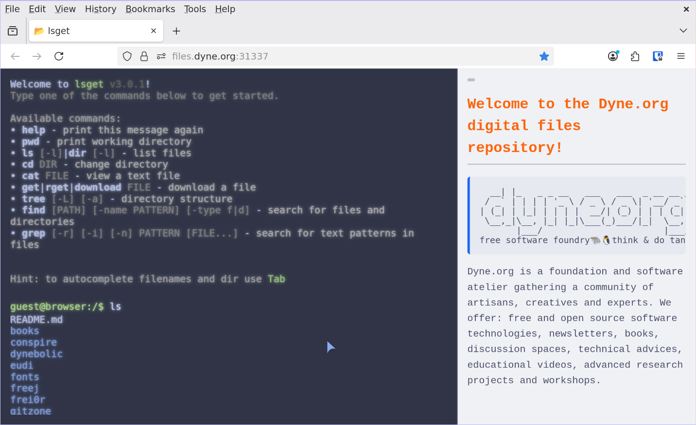

<div align="center">

# lsget

## Neon terminal file explorer in your browser. Read-only FTP, UNIX style interface

</div>

<p align="center">
  <a href="https://dyne.org">
    
  </a>
</p>


---
<br><br>

**lsget** turns any local directory into a mini content delivery network with a web-based Terminal User Interface (TUI). Navigate and interact with your files using familiar Unix commands like `pwd`, `ls`, `cd`, `cat`, and `download` — all from your browser with a retro terminal aesthetic.

Perfect for:
- 🌐 Quickly sharing files over your network with a terminal-style interface
- 📦 Creating a simple self-hosted CDN for static assets
- 🎨 Serving files with a nostalgic hacker-style UI
- 🔧 Development: hot‑reload your server with [Air](https://github.com/cosmtrek/air) via `task dev` for an instant Go hacking loop


## lsget features

| Capability           | Details |
|----------------------|---------|
| **TUI in browser**   | Full-screen Terminal User Interface with reactive updates powered by **[DataStar](https://github.com/starfederation/datastar)**; smooth keyboard handling & command history. |
| **CDN-ready**        | Instantly serve files from any directory with shareable URLs and download capabilities. |
| File operations      | `pwd`, `ls [-l] [-h]`, `cd DIR`, `cat FILE`, `download FILE`, `tree`, `find`, `grep`. |
| Smart autocompletion | Tab‑completes directories and files (text‑only, size‑limited for `cat`). |
| Colourised output    | Directories in bright blue (Ubuntu style) with trailing `/`, executable files highlighted. |
| Session isolation    | Per‑browser *in‑memory* CWD tracked via cookie — multi-user ready. |
| Live reload          | `task dev` ⇒ [Air](https://github.com/cosmtrek/air) rebuilds `main.go` on save for rapid development. |
| Zero‑config binary   | `go run .` or `go build` produces a single executable with embedded assets. |
| Supply chain security| JavaScript dependencies vendored locally to reduce supply chain attacks. |




## [LIVE DEMO](https://files.dyne.org)

<br>

<div id="toc">

### 🚩 Table of Contents

- [💾 Install](#-install)
- [🎮 Quick start](#-quick-start)
- [📟 Available Commands](#available-commands)
- [🚑 Community & support](#-community--support)
- [😍 Acknowledgements](#-acknowledgements)
- [👤 Contributing](#-contributing)
- [💼 License](#-license)

</div>

***
## 💾 Install

### Binary Installation
Single binary, no need to install anything!

```bash
# Download latest release
curl -fsSL  "https://github.com/dyne/lsget/releases/latest/download/lsget-$(uname -s)-$(uname -m)" -o lsget && chmod +x lsget
```

### Docker

Pull the latest Docker image from GitHub Container Registry:

```bash
# Pull latest version
docker pull ghcr.io/dyne/lsget:latest

# Or pull a specific version
docker pull ghcr.io/dyne/lsget:v1.0.0

# Run with Docker
docker run -d \
  -p 8080:8080 \
  -v $(pwd)/files:/data \
  -v $(pwd)/logs:/logs \
  -e LSGET_ADDR=0.0.0.0:8080 \
  -e LSGET_LOGFILE=/logs/access.log \
  ghcr.io/dyne/lsget:latest
```

### Docker Compose

Use the included `docker-compose.yaml`:

```bash
# Start the service
docker-compose up -d

# View logs
docker-compose logs -f
```

**[🔝 back to top](#toc)**

***
## 🎮 Quick start

To start using lsget run the following commands

```bash
# Download and run
./lsget
```
Open your browser at `http://localhost:8080` and enjoy the neon green shell.

### Configuration flags
```
./lsget -h
Usage of ./lsget:
  -addr string
        address to listen on (default "localhost:8080")
  -baseurl string
        base URL for the site (e.g., https://files.example.com)
  -catmax cat
        max bytes printable via cat and used by completion (default 4096)
  -dir string
        directory to expose as root (default ".")
  -logfile string
        path to log file for statistics
  -pid string
        path to PID file
  -sitemap int
        generate sitemap.xml every N minutes (0 = disabled)
  -version
        Print the version of this software and exits
```

### Environment Variables

All configuration flags can also be set via environment variables with the `LSGET_` prefix. Environment variables are used as defaults and can be overridden by command-line flags.

| Environment Variable | Flag Equivalent | Description | Example |
|---------------------|-----------------|-------------|---------|
| `LSGET_ADDR` | `-addr` | Address to listen on (bind address) | `LSGET_ADDR=0.0.0.0:8080` |
| `LSGET_DIR` | `-dir` | Directory to expose as root | `LSGET_DIR=/var/www/files` |
| `LSGET_CATMAX` | `-catmax` | Max bytes for cat command | `LSGET_CATMAX=8192` |
| `LSGET_PID` | `-pid` | Path to PID file | `LSGET_PID=/var/run/lsget.pid` |
| `LSGET_LOGFILE` | `-logfile` | Path to log file for statistics | `LSGET_LOGFILE=/var/log/lsget.log` |
| `LSGET_BASEURL` | `-baseurl` | **Optional:** Public URL (see below) | `LSGET_BASEURL=https://files.example.com` |
| `LSGET_SITEMAP` | `-sitemap` | Sitemap generation interval (minutes) | `LSGET_SITEMAP=60` |

#### About LSGET_ADDR vs LSGET_BASEURL

These serve different purposes and are kept separate for flexibility:

**`LSGET_ADDR`** (required) - Where the server **binds/listens**
- Network-layer configuration
- Examples: `0.0.0.0:8080`, `localhost:8080`, `127.0.0.1:3000`

**`LSGET_BASEURL`** (optional) - What URL users **access publicly**
- Application-layer configuration
- Full URL with protocol, no trailing slash
- Examples: `https://files.example.com`, `https://cdn.company.com`

**When you DON'T need `LSGET_BASEURL`** (auto-detection works):
- ✅ Running locally for development
- ✅ Direct access to the server without reverse proxy
- ✅ Using localhost or direct IP access
- Auto-detects from request headers (`Host`, `X-Forwarded-Proto`)

**When you DO need `LSGET_BASEURL`**:
- 🔧 Behind reverse proxy (Nginx, Caddy, Traefik) with different public URL
- 🔧 Docker with port mapping to a different domain
- 🔧 Generating sitemap.xml with specific canonical URLs
- 🔧 Using `url`/`share` commands for consistent shareable links

**Example usage with environment variables:**

```bash
# Set environment variables
export LSGET_ADDR="0.0.0.0:8080"
export LSGET_DIR="/var/www/files"
export LSGET_LOGFILE="/var/log/lsget.log"

# Run lsget (uses env vars)
./lsget

# Or use with Docker
docker run -e LSGET_ADDR=0.0.0.0:8080 -e LSGET_DIR=/data lsget
```

**Priority order:** Command-line flags > Environment variables > Default values

### Docker Compose

The included `docker-compose.yaml` uses environment variables with sensible defaults. You can customize the configuration by creating a `.env` file:

```bash
# Create directories with proper permissions
mkdir -p files logs
chmod 755 files logs

# Copy the example environment file
cp .env.example .env

# Edit with your preferences
nano .env

# Start the service
docker-compose up -d
```

**Default configuration:**
- **Address**: `0.0.0.0:8080` (accessible from outside container)
- **Directory**: `/data` (mapped to `./files` on host)
- **Log file**: `/logs/access.log` (mapped to `./logs` on host)
- **Port mapping**: `8080:8080` (customizable via `LSGET_PORT` env var)

**Security & Permissions:**

The Docker image uses **Google's Distroless base** for maximum security:
- ✅ **10.9MB** image size (65% smaller than Alpine)
- ✅ No shell, no package manager
- ✅ Minimal attack surface
- ✅ Runs as non-root user (UID 65532)

**Permission Setup for Volumes:**

⚠️ **IMPORTANT**: Since the container runs as UID 65532 (`nonroot` user), mounted volumes **must be writable** for:
- `/data` - Serving files (read access sufficient)
- `/logs` - **Writing access logs** (required for `stats` command to work)

```bash
# Create directories with proper permissions
mkdir -p files logs

# Option 1: World-writable (simplest, works everywhere)
chmod 777 logs
chmod 755 files  # Read-only is fine for serving files

# Option 2: Specific ownership (more secure)
sudo chown -R 65532:65532 files logs

# Option 3: Your user + group write (best for dev)
sudo chown -R $(id -u):$(id -g) files logs
chmod 775 logs  # Needs write for access.log
chmod 755 files
```

**For Coolify/Platform Deployments:**

⚠️ If `stats` command shows "no activity logged yet":
1. **Check volume permissions** - Logs directory must be writable by UID 65532
2. **Coolify**: Volumes are usually auto-mounted, but check persistent storage settings
3. **Manual fix**: SSH into the server and run `chmod 777 /path/to/mounted/logs`
4. **Verify**: Check server logs for "Logging to: /logs/access.log" message on startup

**Example 1: Simple setup (no baseurl needed):**

```bash
# Basic configuration - baseurl auto-detects
LSGET_PORT=8080
LSGET_CATMAX=262144
# LSGET_BASEURL is empty - auto-detection works fine!
```

**Example 2: Behind reverse proxy (baseurl needed):**

```bash
# When lsget runs on http://localhost:8080
# But users access via https://files.example.com
LSGET_ADDR=127.0.0.1:8080
LSGET_BASEURL=https://files.example.com
LSGET_SITEMAP=60
```

**Example 3: Docker with custom domain:**

```bash
# Container binds to 0.0.0.0:8080
# But accessed via custom domain
LSGET_PORT=8080
LSGET_BASEURL=https://cdn.mycompany.com
LSGET_LOGFILE=/logs/access.log
```

**Docker Compose commands:**

```bash
# Start in background
docker-compose up -d

# View logs
docker-compose logs -f

# Stop service
docker-compose down

# Rebuild and start
docker-compose up -d --build
```

**Testing Docker locally with Taskfile:**

```bash
# Build and test Docker image (quick version check)
task docker-test

# Build Docker image
task docker-build

# Run Docker container interactively
task docker-run

# Start with docker-compose
task docker-compose-up

# View docker-compose logs
task docker-compose-logs

# Stop docker-compose
task docker-compose-down

# Rebuild and restart docker-compose
task docker-compose-rebuild
```

### Vendored Dependencies

To enhance security and reduce supply chain attacks, JavaScript dependencies are vendored locally:

**Go dependencies**: lsget has **zero direct Go dependencies** - it uses only the Go standard library. All dependencies in `go.mod` are indirect and only for development tools (air, golangci-lint).

**JavaScript dependencies**: The following libraries are vendored locally and embedded in the binary:
- `marked.min.js` - Markdown rendering library
- `datastar.js` - Reactive UI framework

**Updating vendored dependencies**:

```bash
# Update JavaScript dependencies
task vendor
```

**Benefits**:
- ✅ Protection against supply chain attacks (compromised CDNs, malicious package updates)
- ✅ No runtime dependencies (self-contained binary)
- ✅ Reproducible builds (dependencies locked to specific versions)
- ✅ Offline execution (no internet connection required)
- ✅ Faster builds (no external downloads)

### Available Commands

Once you open lsget in your browser, you can use the following Unix-like commands in the TUI:
```
Available commands:
• help - print this message again
• pwd - print working directory
• ls [-l] [-h]|dir [-l] [-h] - list files (-h for human readable sizes)
• cd DIR - change directory
• cat FILE - view a text file
• sum|checksum FILE - print MD5 and SHA256 checksums
• get|wget|download FILE - download a file
• url|share FILE - get shareable URL (copies to clipboard)
• tree [-L<DEPTH>] [-a] - directory structure
• find [PATH] [-name PATTERN] [-type f|d] - search for files and directories
• grep [-r] [-i] [-n] PATTERN [FILE...] - search for text patterns in files
```
#### Navigation & File Listing

**`pwd`**
Print the current working directory.

**`cd [DIR]`**
Change directory. Use `..` for parent directory, or provide a path relative to current directory.

**`ls [-l] [-h]`** (alias: `dir`)
List files and directories in the current location.
- `-l` — Long format showing permissions, size, and modification time
- `-h` — Human-readable file sizes (KB, MB, GB)

**`tree [-L<N>] [-a] [PATH]`**
Display directory structure as a tree.
- `-L<N>` — Limit depth to N levels (e.g., `-L2` for 2 levels deep)
- `-a` — Show hidden files (files starting with `.`)

#### File Operations

**`cat FILE`**
Display contents of a text file. For images, displays the image inline in the browser.

**`get FILE|PATTERN`** (aliases: `rget`, `wget`, `download`)
Download a file or multiple files. Supports wildcards like `*.txt` or `*.pdf`. When downloading multiple files, they are automatically packaged as a zip archive.

**`url FILE`** (alias: `share`)
Generate a shareable URL for a file. The URL is automatically copied to your clipboard.

**`sum FILE`** (alias: `checksum`)
Calculate and display MD5 and SHA256 checksums for a file.

#### Search & Discovery

**`find [PATH] [-name PATTERN] [-type f|d]`**
Search for files and directories.
- `-name PATTERN` — Match by name pattern (e.g., `*.go`, `test*`)
- `-type f` — Find only files
- `-type d` — Find only directories

**`grep [-r] [-i] [-n] PATTERN [FILE...]`**
Search for text patterns in files.
- `-r` — Recursive search through directories
- `-i` — Case-insensitive search
- `-n` — Show line numbers in results

#### Statistics & Help

**`stats`**
Display access statistics showing file shares, downloads, and checksum operations. Requires the `-logfile` flag to be set when starting lsget.

**`help`**
Display the list of available commands.

#### Special Features

- **Tab completion** — Press `Tab` to autocomplete file and directory names
- **Command history** — Use `↑` and `↓` arrow keys to navigate through previous commands
- **Session isolation** — Each browser maintains its own current working directory via cookies


**[🔝 back to top](#toc)**

***
## 🚑 Community & support

**[📝 Documentation](#toc)** - Getting started and more.

**[🚩 Issues](../../issues)** - Bugs end errors you encounter using lsget.

**[[] Matrix](https://socials.dyne.org/matrix)** - Hanging out with the community.

**[🗣️ Discord](https://socials.dyne.org/discord)** - Hanging out with the community.

**[🪁 Telegram](https://socials.dyne.org/telegram)** - Hanging out with the community.


**[🔝 back to top](#toc)**

***
## 😍 Acknowledgements

<a href="https://dyne.org">
  
</a>


Copyleft 🄯 2025 by [Dyne.org](https://www.dyne.org) foundation, Amsterdam

Designed, written and maintained by Puria Nafisi Azizi with contributions by Denis Jaromil Roio

**[🔝 back to top](#toc)**

***
## 👤 Contributing

Please first take a look at the [Dyne.org - Contributor License Agreement](CONTRIBUTING.md) then

1.  🔀 [FORK IT](../../fork)
2.  Create your feature branch `git checkout -b feature/branch`
3.  Commit your changes `git commit -am 'feat: New feature\ncloses #398'`
4.  Push to the branch `git push origin feature/branch`
5.  Create a new Pull Request `gh pr create -f`
6.  🙏 Thank you


**[🔝 back to top](#toc)**

***
## 💼 License
    lsget - **Neon terminal file explorer in your browser. Read-only FTP, UNIX style interface**
    Copyleft 🄯2025 Dyne.org foundation, Amsterdam

    This program is free software: you can redistribute it and/or modify
    it under the terms of the GNU Affero General Public License as
    published by the Free Software Foundation, either version 3 of the
    License, or (at your option) any later version.

    This program is distributed in the hope that it will be useful,
    but WITHOUT ANY WARRANTY; without even the implied warranty of
    MERCHANTABILITY or FITNESS FOR A PARTICULAR PURPOSE.  See the
    GNU Affero General Public License for more details.

    You should have received a copy of the GNU Affero General Public License
    along with this program.  If not, see <http://www.gnu.org/licenses/>.

**[🔝 back to top](#toc)**
